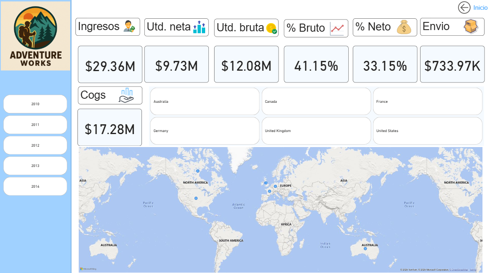

🧠 Inteligencia Comercial y Predicción de Ventas
Caso Adventure Works – Proyecto de Business Intelligence

Este proyecto se centró en el desarrollo de un tablero ejecutivo en Power BI para Adventure Works, una empresa ficticia del sector bicicletas. El objetivo fue analizar el rendimiento comercial e implementar modelos de predicción de ventas para el año 2014, integrando análisis geoespacial, segmentación de productos y enfoques predictivos.

📊 Componentes del Análisis
Modelado de datos con Power Query y DAX

Visualización ejecutiva de ingresos, márgenes y rentabilidad por producto

Segmentación geográfica y análisis de concentración de mercado

Enriquecimiento del análisis con prompts inteligentes en ChatGPT

🔍 Principales Hallazgos
🧮 Alta rentabilidad en accesorios: Mayor margen de utilidad pese a su menor volumen de ventas.

🇺🇸 Concentración en EE.UU, la mayor parte de los ingresos provienen de EE.UU., especialmente de California.

⚠️ Dependencia de clientes clave: Exposición significativa a un grupo reducido de compradores.

📉 Caída de ventas en 2014: Descenso en ventas de bicicletas impactó los ingresos totales.

🔎 Zonas clave: California, Washington y Oregon en EE.UU.; Australia como segundo mercado.

📈 Proyección de ingresos: Modelos sugieren una recuperación moderada, sin alcanzar niveles de 2013.

💡 Recomendaciones Estratégicas
Reforzar productos de alta rentabilidad dentro de cada categoría.

Diversificar regiones para mitigar el riesgo de concentración geográfica.

Implementar alertas automatizadas para detectar caídas bruscas en ventas.

🛠️ Herramientas y Tecnologías
Microsoft Power BI

DAX & Power Query

Visualización ejecutiva

Modelado predictivo

Prompts de IA con ChatGPT

